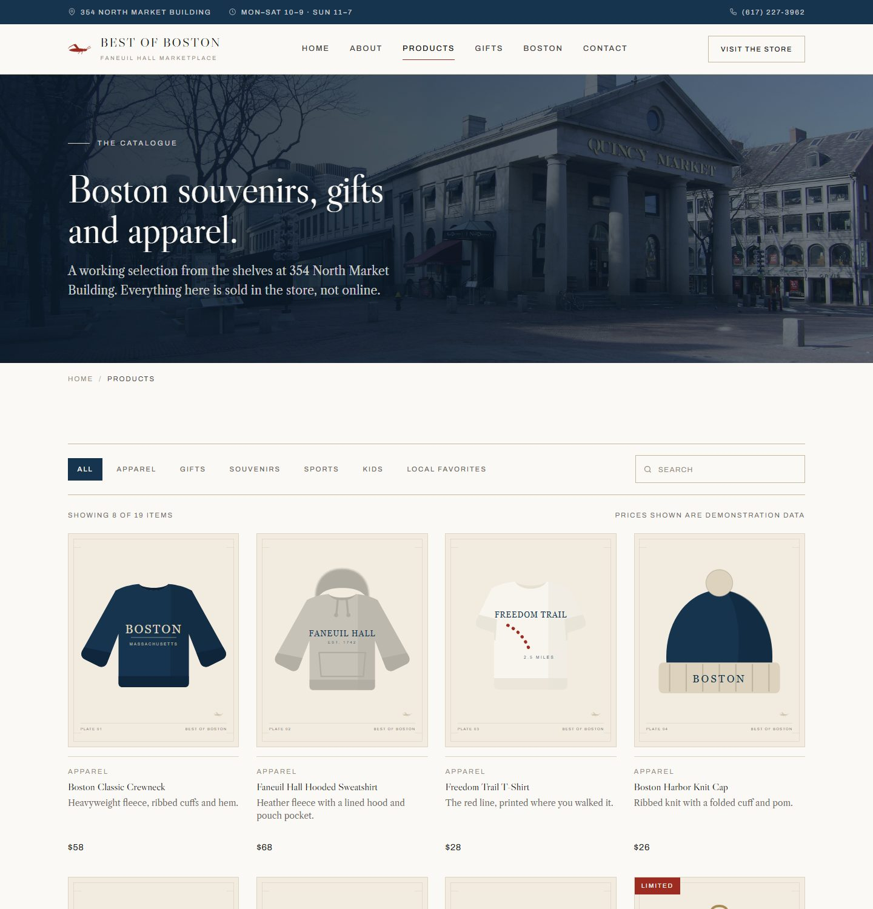
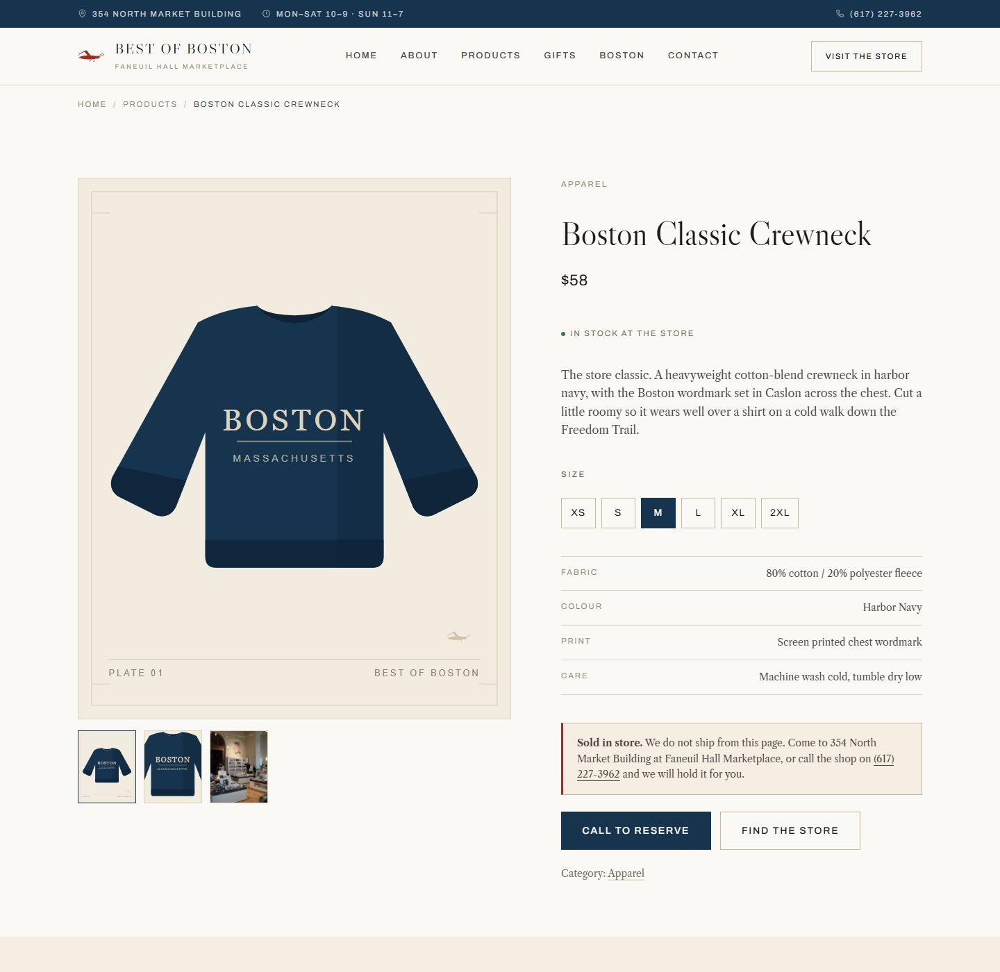
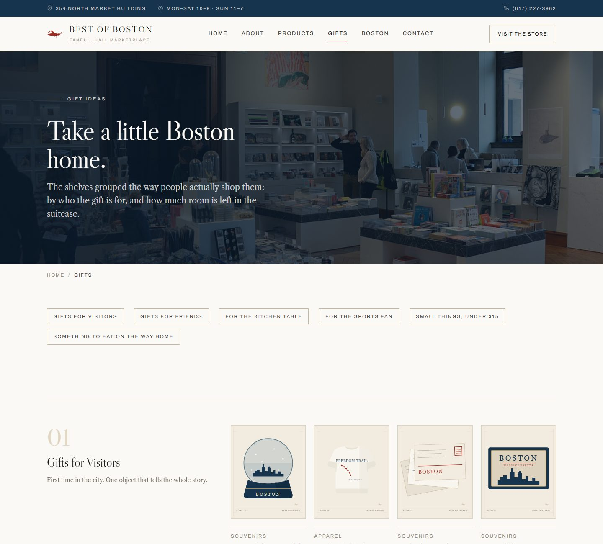
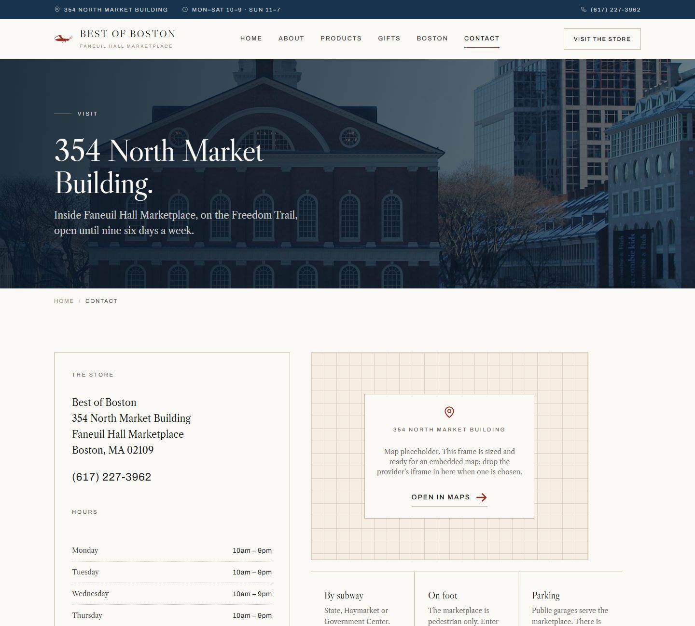

# Best of Boston — Storefront

**Front-end completo de site para uma loja física americana**, feito em HTML, CSS e JavaScript puros.
Sem framework, sem build, sem dependências. Abra o `index.html` e o site funciona.

> **EN** — A complete, dependency-free storefront front-end for a real gift & souvenir shop in Boston.
> Seven pages, a data-driven catalogue with filters, search and pagination, product detail pages,
> a curated gift guide, fully responsive layout and accessibility-first markup. Built to show what
> a well-crafted static front-end for a brick-and-mortar store looks like.

**Demo online:** https://gustavon-s.github.io/bestofboston-storefront/


---

## Sobre o projeto

A **Best of Boston** é uma loja real de presentes e souvenirs dentro do Faneuil Hall Marketplace, em
Boston (354 North Market Building). Este repositório é o site institucional dela: uma vitrine que
apresenta a loja, o catálogo, ideias de presente, a região em volta e como chegar.

O objetivo é servir de **portfólio e template**: mostrar um front-end bem feito para comércio de
rua, com identidade visual própria, catálogo dinâmico e cuidado com performance e acessibilidade,
sem depender de nenhuma ferramenta além do navegador.

| Página | O que faz |
|---|---|
| `index.html` | Home: hero, apresentação da loja, categorias, produtos em destaque, chamada para visita |
| `about.html` | História da loja e do mercado, com linha do tempo |
| `products.html` | Catálogo com filtro por categoria, busca por texto e paginação |
| `product.html` | Página de produto: galeria, seletor de tamanho, ficha técnica, produtos relacionados |
| `gifts.html` | Guia de presentes agrupado por ocasião e faixa de preço |
| `boston.html` | A cidade e a Freedom Trail em volta da loja |
| `contact.html` | Endereço, horários, como chegar, espaço para mapa e formulário com validação |

---

## Screenshots

| Catálogo | Produto |
|---|---|
|  |  |

| Presentes | Contato |
|---|---|
|  |  |

---

## Como rodar

Não precisa instalar nada.

```bash
git clone https://github.com/GustavoN-S/bestofboston-storefront.git
cd bestofboston-storefront
```

Depois abra `index.html` no navegador. Funciona direto do sistema de arquivos.

Se preferir um servidor local (útil para testar no celular na mesma rede):

```bash
python -m http.server 8080
# ou
npx serve .
```

E acesse `http://localhost:8080`.

---

## Stack

- **HTML5** semântico, uma página por arquivo
- **CSS3** com custom properties, `clamp()` para tipografia fluida, grid e flexbox
- **JavaScript** vanilla, sem bibliotecas
- **Google Fonts**: Libre Caslon (títulos e texto) e Archivo (interface), com fallback para Palatino e Georgia
- **Python 3** apenas para o script opcional que gera as ilustrações de produto em SVG

A única dependência externa em tempo de execução são as fontes do Google. Se não carregarem, a
pilha de fallback mantém o caráter editorial do layout.

---

## Estrutura

```
bestofboston-storefront/
├── index.html · about.html · products.html · product.html
├── gifts.html · boston.html · contact.html
│
├── css/
│   ├── main.css          Tokens de design, reset, tipografia, primitivas de layout
│   ├── components.css    Cabeçalho, rodapé, botões, cards, formulários, galeria
│   └── responsive.css    Breakpoints: 1180 / 1024 / 860 / 640 / 420
│
├── js/
│   ├── main.js           Namespace BOB com utilitários compartilhados (carregar primeiro)
│   ├── media.js          Resolve os slots de imagem a partir do registro central
│   ├── navigation.js     Menu mobile, cabeçalho fixo, gestão de foco
│   ├── products.js       Catálogo, filtros, busca, paginação, produto, presentes
│   └── interactions.js   Galeria, seletor de tamanho, validação de formulário, reveal ao rolar
│
├── data/
│   ├── products.js       Catálogo: categorias, produtos e curadoria de presentes
│   └── media.js          Registro central de fotografias
│
├── assets/
│   ├── images/photos/    Fotografias de Boston (Wikimedia Commons, com atribuição)
│   ├── images/products/  Pranchas de produto em SVG, geradas por script
│   └── icons/            Favicon
│
├── tools/make-plates.py  Gera as pranchas de produto
├── docs/screenshots/     Imagens deste README
├── ATTRIBUTION.md        Licença e autor de cada fotografia
└── LICENSE               MIT (código)
```

A ordem dos `<script>` no fim de cada página importa: os arquivos de `data/` vêm antes dos de
`js/`, e `js/main.js` vem antes dos demais scripts.

---

## Como funciona

### Catálogo orientado a dados

Nenhum produto está escrito no HTML. Tudo vem de `data/products.js`, em três listas:

- `BOB_CATEGORIES`: as seis categorias, usadas nos filtros e na home
- `BOB_PRODUCTS`: o catálogo
- `BOB_GIFT_EDITS`: a curadoria da página de presentes, que só aponta para ids de produto

Cada produto segue este formato:

```js
{
  id: 'boston-classic-crewneck',   // slug único, usado em product.html?id=<id>
  name: 'Boston Classic Crewneck',
  category: 'apparel',             // id de uma categoria em BOB_CATEGORIES
  price: 58,                       // número em USD
  image: 'boston-classic-crewneck.svg',   // arquivo em assets/images/products/
  note: 'Heavyweight fleece, ribbed cuffs and hem.',   // linha curta do card
  description: '...',              // parágrafo da página de produto
  details: [['Fabric', '80% cotton / 20% polyester fleece'], ['Colour', 'Harbor Navy']],
  sizes: ['XS', 'S', 'M', 'L', 'XL', '2XL'],           // ou null quando não se aplica
  stock: 'in-store',               // 'in-store' ou 'limited'
  tags: ['sweatshirt', 'navy', 'classic'],             // usados pela busca e pelo guia de presentes
  featured: true                   // aparece nos destaques da home
}
```

O arquivo `js/products.js` lê essas listas e monta os cards, os filtros, a busca, a paginação, a
página de produto (lendo `?id=` da URL) e os produtos relacionados. Para ligar um backend ou CMS,
basta preencher `window.BOB_PRODUCTS` com o mesmo formato antes de `js/products.js` rodar.

### Registro central de imagens

Nenhum caminho de foto está espalhado pelo HTML. As páginas marcam apenas um espaço:

```html
<div class="media media--4x3" data-media="market-rotunda"></div>
```

E `data/media.js` diz qual arquivo e qual texto alternativo vão ali:

```js
'market-rotunda': {
  src: 'market-hall-interior.jpg',
  alt: 'Rotunda do Quincy Market vista de baixo'
}
```

Trocar uma foto é trocar uma linha. Se o arquivo não existir, o slot vira um bloco quadriculado
com etiqueta, nunca um ícone de imagem quebrada. Proporções disponíveis: `media--1x1`, `--4x3`,
`--3x2`, `--4x5`, `--3x4`, `--16x9`, `--21x9` e `--tall`.

### Ilustrações de produto

As imagens de produto são SVGs desenhados para o projeto, com moldura, número de prancha e a marca
do gafanhoto. São propositalmente uniformes: fotos de fontes diferentes deixariam o catálogo com
cara de colagem. Para regenerar todas:

```bash
python tools/make-plates.py
```

Quando houver fotografia real, é só gravar os arquivos com o mesmo nome em `assets/images/products/`
(podem ser `.jpg`) e atualizar o campo `image` de cada produto em `data/products.js`.

### Identidade visual

- **Tipografia**: Caslon é o tipo da imprensa colonial americana, o que faz sentido para uma loja
  na Freedom Trail. Archivo cuida de navegação, rótulos e preços.
- **Cores**: papel e creme como base, azul-marinho de porto para estrutura, vermelho tijolo apenas
  como destaque, latão nos filetes. Todos os tokens estão no `:root` de `css/main.css`.
- **Marca**: o gafanhoto é o cata-vento que fica sobre o Faneuil Hall desde 1742. Aparece no
  cabeçalho, no selo, no rodapé, no favicon e como marca d'água nas pranchas.
- **Detalhes gráficos**: faixas quadriculadas, filetes finos, selo circular com texto em arco,
  etiquetas de preço com furo, molduras de prancha. Usados com parcimônia.

### Responsivo

Cinco breakpoints (1180 / 1024 / 860 / 640 / 420). Tipografia e espaçamentos usam `clamp()`, então
o layout escala de forma contínua entre eles. No celular o menu vira um painel, o catálogo vira uma
coluna e os filtros passam a rolar na horizontal.

### Acessibilidade

- HTML semântico, um `<h1>` por página, landmarks e breadcrumb
- Link "Skip to content" em todas as páginas
- Foco visível em tudo que é focável. O menu mobile prende o Tab e fecha no Esc
- Todas as imagens têm `alt`. As decorativas têm `alt=""`
- Formulário com `<label>`, `aria-invalid` e erros anunciados por `aria-live`
- `prefers-reduced-motion` desliga as animações
- Ações são `<button>`, navegação é `<a>`

---

## Conteúdo real e conteúdo de demonstração

**Real:** nome, endereço, telefone, horários, o fato de a loja ter dois andares, as categorias
vendidas e a história do Faneuil Hall e do Quincy Market.

**Demonstração:** todos os produtos (nomes, preços, descrições, tamanhos, fichas técnicas), as
ilustrações de produto e o formulário de contato, que valida mas não envia. O rodapé de cada página
avisa isso ao visitante. Ao ligar dados reais, remova o aviso do rodapé e a flag `BOB_DEMO_DATA`
no topo de `data/products.js`.

---

## Pontos de extensão

O que já está preparado, faltando apenas ligar:

1. **Mapa**: o bloco `.mapframe` em `contact.html` está dimensionado para receber o `iframe` do
   provedor escolhido. Substitua o conteúdo de `.mapframe__pin`.
2. **Formulário**: `js/interactions.js` valida os campos e mostra o estado de envio. O `fetch()`
   para o backend entra na função `contactForm`.
3. **Dados dinâmicos**: ver "Catálogo orientado a dados" acima.
4. **Rotas**: hoje as páginas estão na raiz. Se forem para subpastas, ajuste a constante `prefix`
   em `js/media.js` e os caminhos relativos do cabeçalho.

---

## Licença

O código está sob a licença [MIT](LICENSE).

As fotografias em `assets/images/photos/` vieram do Wikimedia Commons sob licenças livres
(CC BY, CC BY-SA, CC0 e domínio público). A relação completa, com autor e licença de cada arquivo,
está em [ATTRIBUTION.md](ATTRIBUTION.md). Se reutilizar o site, mantenha a atribuição das imagens
que a exigem.

---

Feito por [GustavoN-S](https://github.com/GustavoN-S).
